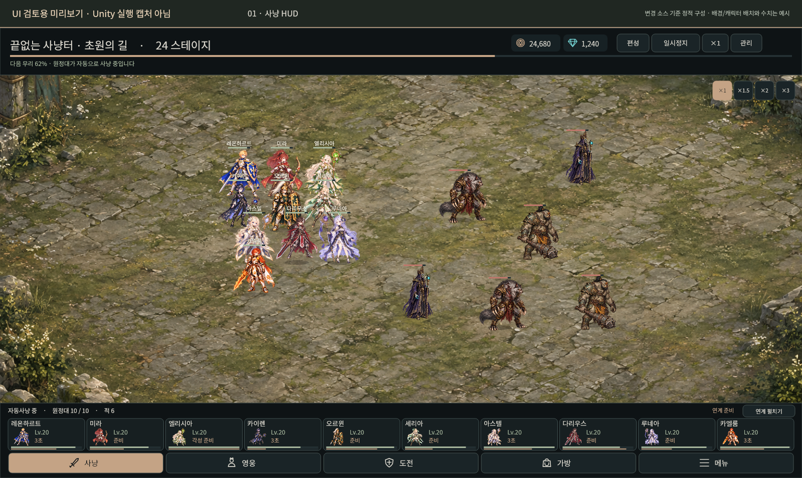
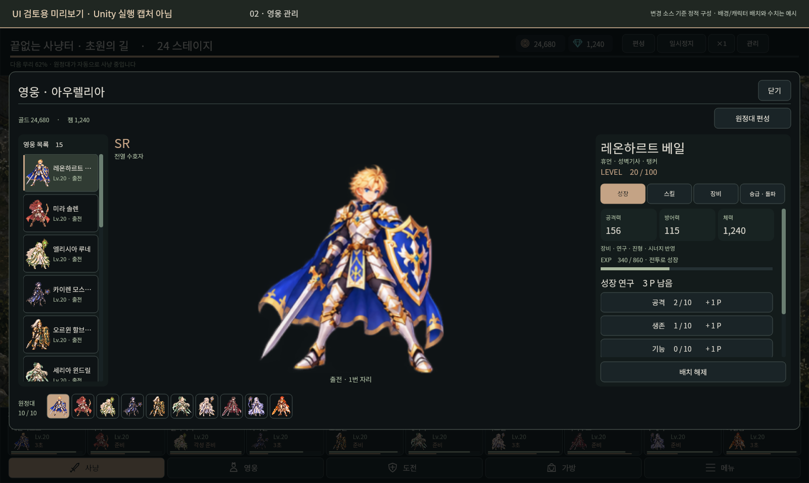
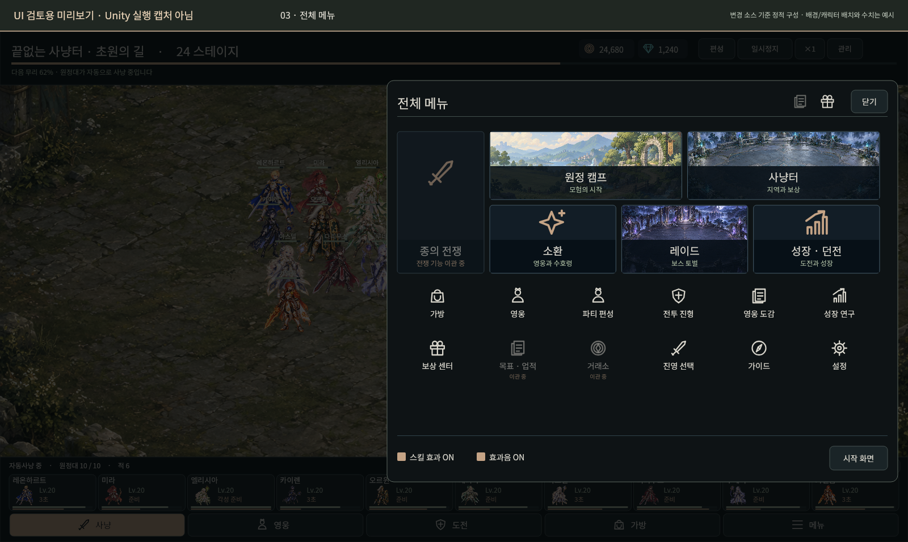

# UI 개편 검토 이미지

**모든 이미지는 UI 검토용 미리보기이며 Unity 실행 캡처가 아니다.** 수정한 Unity 소스의 배치·문구와 저장소의 원본 그림을 사용해 정적 Canvas로 재구성했다. 전투 배치·진행 수치·게이지는 예시다. 실제 Unity 렌더링, 애니메이션, 입력, 반응형 배치의 검증 자료로 사용하지 않는다.

## 전체 사냥 화면

상단 상태·재화, 하단 영웅 10칸과 5개 메뉴를 확인할 수 있다.

## 영웅 화면

Godot의 영웅 목록·큰 원본 초상·상세 탭·편성 슬롯 구성을 옮겼다.

## 전체 메뉴

오른쪽 서랍의 대표 카드·아이콘 메뉴·설정을 확인할 수 있다. 아직 Unity 동작이 없는 콘텐츠는 비활성으로 표시한다.

## 재현과 검증 범위

- [변경 범위](../../docs/unity-migration/UI_OVERHAUL_2026_10_09_KO.md)
- [정적 C# 검사 결과](source-validation.json): 109개 파일 구문 오류 0개. Unity 컴파일·실행은 미실행.
- [이미지 출처 및 생성 기록](previews/preview-provenance.json)
- `previews/build_review_preview.py`는 저장소 원본과 한국어 글꼴을 모아 검토 데이터를 만든다. 큰 생성 HTML은 Git에서 제외한다.
- `previews/render_review_canvas.cjs`가 이번 PNG를 생성했다. Node의 `sharp`, `@napi-rs/canvas`를 사용하며 패키지 위치는 `CODEX_PRIMARY_RUNTIME_NODE_MODULES`로 지정한다.
- `review-template.html`과 `render_review_preview.cjs`는 브라우저용 보조 자료다. 이 환경에는 브라우저 실행 파일이 없어 해당 경로의 화면 검증은 하지 못했다.

이전 체크포인트의 실제 게임 캡처나 APK는 이번 소스 변경을 반영한 새 실행 증거가 아니다.
