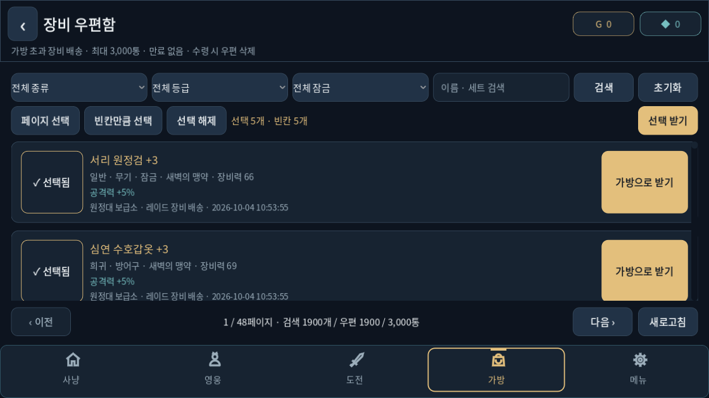
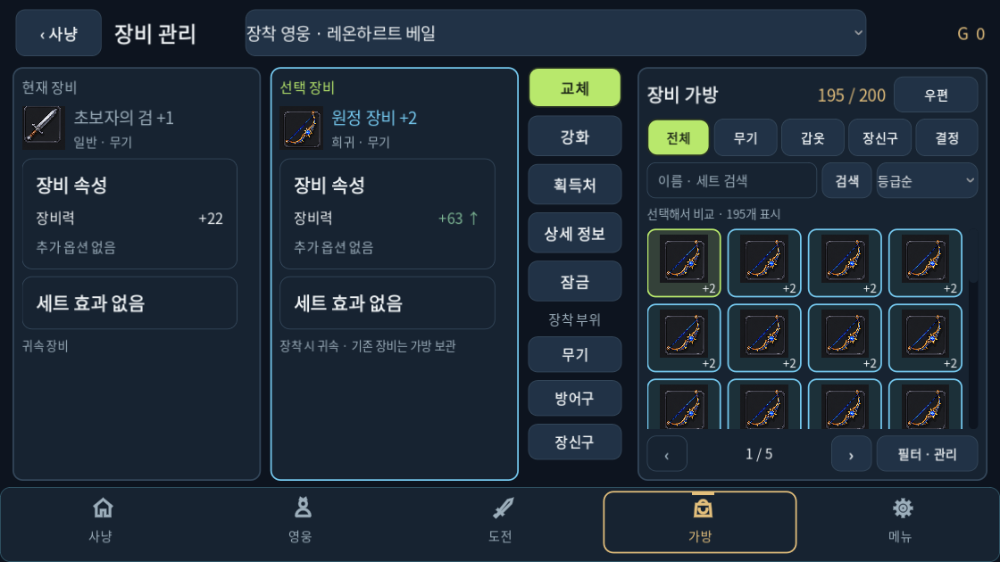

# 장비 우편과 안전한 보상 배송

가방 200칸을 넘는 장비를 **장비 우편함**으로 배송한다. 기존 보호 보관 장비는 원래 ID·잠금·귀속·옵션을 유지하며 우편으로 이어받는다. 일반 장비도 배송하며, 가방이 찼다는 이유로 장비를 분해하거나 기존 장비를 교체하지 않는다. 사용자가 직접 정한 등급별 자동 분해 설정과 자동 장착은 유지한다.

## 이용 흐름

- 우편 한도는 **3,000통**, 장비·옵션 결정 1개당 1통이다. **자동 만료와 일괄 삭제가 없다.** 수령하면 첨부 장비를 가방으로 옮기고 해당 우편을 삭제한다.
- 발송처·배송 사유·발송 시간을 표시한다. 기존 보관 장비의 날짜는 임의로 만들지 않고 `기존 장비 이관 · 날짜 미상`으로 표시한다. 시간 표시는 UTC다.
- 장비 우편이 있으면 가방에 `우편` 바로가기가 나타난다. `필터 · 관리`에서도 빈 우편함을 열 수 있다. 그림 카드·아이콘 전체 메뉴의 구조는 유지한다.
- 우편은 **40개씩** 만든다. 종류·등급·잠금 필터, 이름·세트 검색, 고정된 이전·다음 버튼으로 원하는 장비를 찾는다.
- `선택`은 `✓ 선택됨`으로 표시한다. 페이지를 넘겨도 선택을 유지한다. 검색·필터 변경 시 선택을 비워 숨겨진 장비를 잘못 받지 않도록 한다.
- `페이지 선택`, `빈칸만큼 선택`, `선택 받기`와 개별 수령이 있다. 선택 수와 가방 빈칸을 표시한다. 빈칸이 부족하면 선택 전체를 우편에 남긴다.
- 검색·수령·페이지 이동 버튼은 목록 스크롤과 별도로 화면에 남는다. 마지막 페이지 수령 후 유효한 페이지로 조정하고, 같은 페이지에서는 가능한 범위에서 스크롤을 유지한다. 뒤로 가기는 가방으로 연결한다.

## 한도와 보상 보호

한도가 찼을 때 기존 장비를 밀어내거나 첨부 장비를 없애지 않는다. 일반 사냥은 한 번의 부대 보상에 필요한 최대 **5칸**의 안전 공간을 가방·우편 합계로 확보한다. 부족하면 HP·전투 시간·보상·난수 소비를 멈추고 정리를 안내한다. 공간 확보 후 기존 사냥을 재개한다. 여러 부대가 동시에 죽어도 공간이 부족한 부대의 보상 수령권은 소비하지 않는다.

레이드는 입장 전에 **우편 빈칸 2개**를 확보한다. 전투 중에는 다른 배송이 이 두 칸을 사용하지 못한다. 옵션 추출 역시 먼저 공간을 확인하므로 원본 옵션·정수만 소비되고 결정이 사라지는 상황을 막는다.

오프라인 성장·골드 보상은 기존 방식으로 정산한다. 장비 공간이 부족하면 탐색 횟수와 원래 지역을 저장해 배송 대기한다. 공간이 생겼을 때 최대 32회씩 처리하며, 대기 중에는 장비 난수를 소비하지 않는다. 보상 안내와 우편함에 대기 횟수를 표시한다. 수령 후 재접속·저장 재시도가 탐색 보상을 다시 만들지 않는다.

기존 저장에 3,000개가 넘는 보관 장비가 있어도 모두 보존한다. 한도는 새 배송에 적용한다. 저장 버전 37의 기존 `equipment_overflow` 배열을 첨부 장비 소유권으로 사용하고, 선택적인 `equipment_mail_headers`와 `pending_equipment_rolls` 필드를 추가했다. 우편 제목·시간에는 장비 사본을 넣지 않는다. 거래소의 기존 구매·등록 취소 배송은 별도 수령 흐름을 유지한다.

개별·일괄 수령은 ID 존재·중복·가방 및 장착 장비와의 충돌·가방 빈칸을 모두 확인한 뒤 한 번에 이동하고 **한 번 저장**한다. 저장 실패·최신 저장 버전·연습 중에는 추가 수령을 막는다. 저장 실패 결과는 메모리에 유지하며 재시도는 현재 결과를 저장한다. 드래그로 스크롤한 수령 버튼과 취소된 터치는 수령을 실행하지 않는다.

## 검사와 측정

대용량 우편 첫·중간·마지막 페이지와 200개 일괄 수령, 잠금·귀속·옵션 보존, 중복 및 사라진 ID 거부, 실제 터치·드래그·취소, 4개 화면 크기, 배경 사냥 상태 보존을 검사했다. 신규 우편 검사는 한도·기존 초과 장비 이관·오프라인 배송 대기·실제 저장/재접속·실패 재시도·사냥 정지/재개·레이드 예약·부대 보상 수령권 보류를 확인한다. 기존 장비·UX·터치·사냥·연습·저장 회귀 검사도 실행했다.

50·500·1,900개 조건에서 현재 페이지의 UI 노드는 모두 **453개**였다. 기존 화면은 각각 488·4,538·17,138개였다. 새 측정의 동기 화면 생성 시간은 약 1.24·1.35·1.21초다. 병렬 검사와 함께 실행한 **Godot 4.6.3 headless Linux VM 측정**이며 Android 지연이나 FPS 측정이 아니다. 실제 렌더 이미지는 Xvfb와 OpenGL 호환 모드에서 확인했다. 목표 엔진 4.7.2와 실제 Android 장시간 검사는 별도로 필요하다.

기능 회귀 **15개 묶음·4,372항목**, 변경 스크립트 파싱 **20/20**이 통과했다. 양 진영의 30일 성장 모델(시드 3401)도 기존 성장·재화 유효성 검사를 통과했다. 이 모델은 매일 10분 사냥과 8시간 오프라인 보상을 적용하며 가방·우편 수동 정리를 하지 않는다. 7일 우편은 각각 **1294·1432통**, 30일은 둘 다 **3,000통**이었다. 따라서 무정리 연속 사냥 한 달을 보장하는 결과가 아니며, 가득 찼을 때의 대기 정책과 정리 필요성을 확인했다. [성장 모델 원자료](../checks/stash-improvement/economy-30/summary.json)에 결과를 남겼다.

최종 결과는 [검사 기록](../checks/stash-improvement/verification.json), [성능 측정](../checks/stash-improvement/performance.json), [파싱 기록](../checks/stash-improvement/parse.json)에 있다. 구조 검사의 기존 저장 함수 두 항목과 Main 크기 제한 실패는 변경 전후 동일하다. [비교 기록](../checks/stash-improvement/architecture.json)에 남겼으며 통과로 집계하지 않는다.

저장 직전 원격에 추가된 영웅 아트·사냥 배경 시안 커밋 `37c3028`을 보존하여 통합했다. 우편과 기존 검사 대상 게임 코드의 해시는 동일하며, 통합 후 우편·터치·사냥 상태의 4개 검사(766항목)를 다시 통과했다. [통합 검사](../checks/stash-improvement/integration/regression.json)를 참조한다.

후속 우선순위는 레이드 준비 상태에 맞는 다음 행동 안내와 일괄 강화 비용 예고다. 우편에 일반 장비까지 쌓이므로 명시적인 보호 장비 정리와 장기 소비처 설계는 별도 작업으로 남아 있다.
