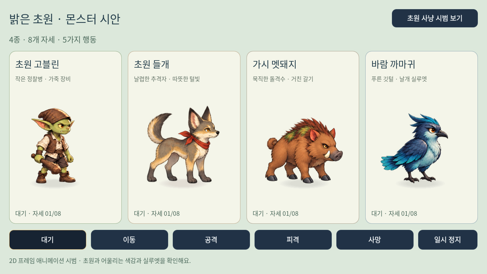
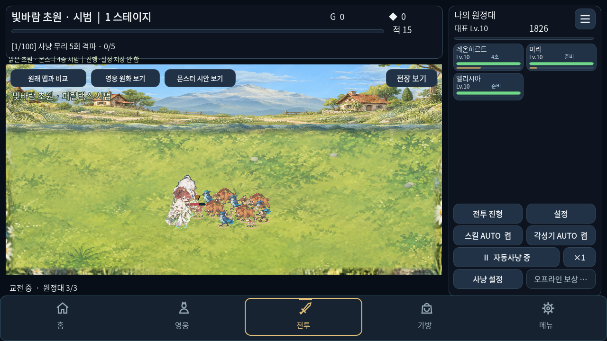

# 초원 몬스터와 레온하르트 표시 개선

Godot 4.7.2의 독립 시범 `scenes/art/ArtDirectionLab.tscn`에서 새 몬스터를 실제 자동사냥에 연결합니다. F6로 실행하고 **몬스터 시안 보기**를 누르면 4종을 크게 비교하며 행동을 바꿀 수 있습니다. 시안만 볼 때는 `scenes/art/MonsterConceptStudy.tscn`을 직접 실행합니다.

## 몬스터 원화와 동작

초원 고블린, 들개 무리, 가시 멧돼지, 바람 까마귀를 밝은 초원과 어울리는 회화풍으로 제작합니다. 각 1536×1024 투명 아틀라스의 4×2로 배치한 8개 자세를 다음처럼 사용합니다.

| 행동 | 자세 | 표시 기준 |
| --- | --- | --- |
| 대기 | 0, 1 | 종별 위상을 둔 느린 반복 |
| 이동 | 2, 3 | 좌우 보폭 반복 |
| 공격 | 4, 5 | 기존 공격 애니메이션 진행률에 따른 준비·타격 |
| 피격 | 6 | 기존 피격 상태와 섬광 |
| 사망 | 7 | 기존 사망 상태와 투명도 변화 |

공격 시 무기·날개가 잘리지 않도록 자세별 실제 영역을 지정합니다. 공중 자세의 발 기준점은 그림 바깥 지면까지 허용합니다. 원화의 알파 경계와 발 기준점을 기록하고 프레임마다 같은 바닥 위치에 맞춥니다. 픽셀 크기는 대기 자세의 기준 높이로 고정하여 공격·사망 이미지의 외곽 크기가 달라도 몸 전체가 커지지 않게 합니다. 원본 제어기는 그대로 두고 실제 3D 표시 노드의 그림·오프셋·표시 크기만 교체합니다. 해당하지 않는 몬스터와 보스는 기존 표시를 사용합니다.

이는 **4종 × 8개 자세의 2D 프레임 애니메이션**입니다. 몬스터용 3D 모델·골격·방향별 원화를 제작한 것은 아니며, 좌우 방향은 같은 원화를 반전합니다. 원화 시트 사이의 형태 변화와 2프레임 보행의 부드러움은 후속 보간 원화 제작으로 개선할 수 있습니다.

## 영웅과 접지 표현

레온하르트의 기존 GPU 골격을 사용하면서 실제 이동 거리에 맞춘 보폭, 연속 호흡과 작은 후속 움직임을 보강합니다. 실제 스킨에 얇은 윤곽과 빛 표현을 적용하며 아틀라스의 다른 칸을 샘플링하지 않도록 경계를 제한합니다. 원본 공격 시간·완료 신호·피해는 바꾸지 않습니다.

영웅과 몬스터의 균일한 원판 그림자를 가장자리가 부드러운 지면 그림자로 바꿉니다. 발걸음 먼지는 실제 이동 거리에서만 발생하고 동시 16개로 제한합니다. 게임의 무작위 생성기를 사용하지 않으며, 메뉴·정지·원래 맵 비교에서는 새 표시 효과의 시간이 진행하지 않습니다.

새 레온하르트 고해상도 4등신 원화는 여전히 정적인 시안입니다. 이번 영웅 보강은 **기존 원화·골격의 표시 개선**이며, 새 원화의 부위 분리나 16종 신규 애니메이션 완성을 뜻하지 않습니다.

## 적용 범위

- 실제 시범 사냥의 적 표시와 독립 몬스터 검토 화면에 적용합니다.
- 가로 전용, 장비 200칸, 8방향 진입·이동·진형·대상 선택·피해·보상을 유지합니다.
- `project.godot`와 기본 F5 장면은 이전 디자인을 유지합니다. GitHub에는 검토 장면과 자산을 함께 게시합니다.
- 시범은 기존 진행·설정 저장본을 읽거나 덮어쓰지 않습니다. 자세한 저장 격리 범위는 [시범 안내](ART_DIRECTION_PILOT_KO.md)를 따릅니다.

원화의 생성 프롬프트·해시·실제 크기·알파 검사 기록은 [몬스터 자산 출처](../assets/art-direction/pilot-01/monsters/monster-art-source.json)에 기록합니다. 실행 화면과 영상, 검증 결과는 [이번 검증 폴더](../checks/hero-monster-pilot)에 보관합니다. 모바일 실기기의 FPS·메모리·발열은 별도 검증이 필요합니다.

## 실행 검증

변경 관련 스크립트 9/9개, 새 표시 검사 1,218개와 기존 시범 회귀 412개를 합쳐 **1,630개 검사**를 통과했습니다. 4종 모두 실제 상태에서 8개 자세를 관측했고, 실제 8방향 전투와 4,844개 화면 좌표·저장 격리를 재검증했습니다.

실제 렌더 화면 8장과 **12.58초 플레이 영상**을 기록했습니다. 영상의 24fps는 녹화 형식이며 모바일 실기기 성능값이 아닙니다.

[실행 영상](../checks/hero-monster-pilot/pilot-live.mp4) · [검증 결과](../checks/hero-monster-pilot/regression.json)
