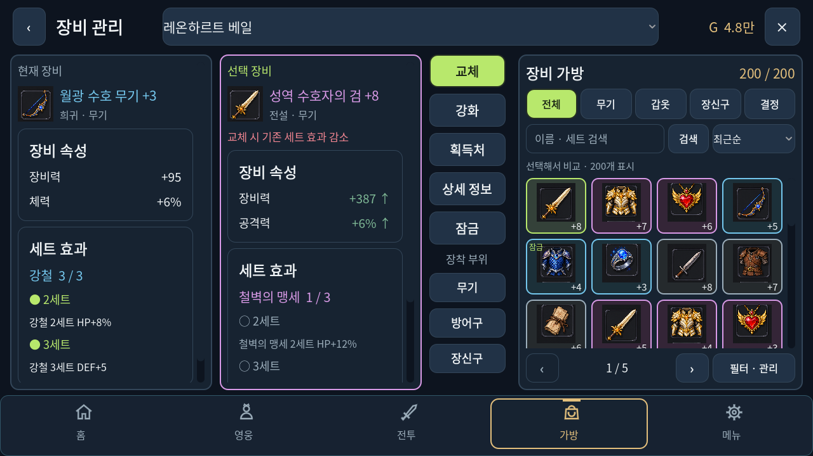
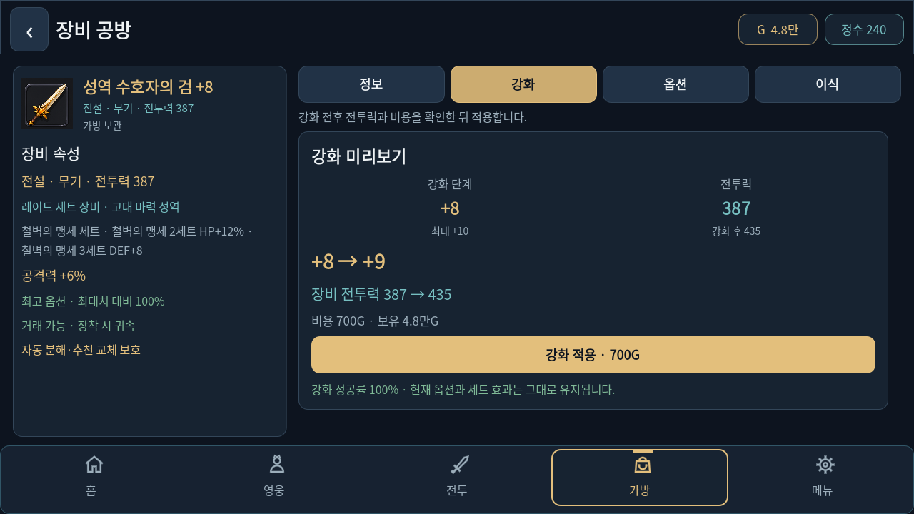

# 가로 전용 화면·200칸 장비 가방

## 개발 기준과 적용 상태

사용자 요청에 따라 게임 개발 방향을 **가로 전용**으로 고정합니다. 기준 화면은 1280×720, Godot 엔진은 4.7.2입니다. 세로형 화면으로 전환하는 후속 개발은 현재 범위에 포함하지 않습니다.

이전 맵·레이드·영웅 골격·공통 UI·8방향 전투 개선은 원격 `main`의 `83476a92c1018066d34bf3743e58f9006a33497f`까지 반영했습니다. 이 문서의 가로 장비 화면 작업도 검증을 마쳤으며 현재 기준 브랜치는 `main`입니다.

## 장비 화면 구성

사용자가 제공한 가로 장비창 이미지를 참고해, 목록을 누르면 같은 화면에서 현재 장비와 후보를 비교하는 구조를 구현했습니다. 게임의 기존 장비 아이콘과 능력치 규칙을 사용합니다.

- **왼쪽 비교 카드 2개:** 현재 장비와 선택 장비의 이름·등급·강화 단계·장비 속성·세트 상태를 나란히 표시합니다.
- **중앙 작업 버튼:** 교체, 강화·공방, 획득처, 상세 정보, 잠금과 부위별 선택을 모읍니다. 옵션 결정을 선택하면 교체 버튼은 이식으로 바뀝니다.
- **오른쪽 가방:** 4열 아이콘 목록에 강화 단계·잠금 상태·선택 테두리를 표시합니다. 한 페이지당 40개이며, 필터 없는 200개 가방은 5페이지입니다. 각 페이지 안에서 스크롤합니다.
- **탐색:** 전체·무기·갑옷·장신구·결정 분류, 이름·세트 검색, 등급·장비력·옵션·최근순 정렬을 사용합니다. 검색·분류를 바꾸면 첫 페이지로 이동합니다.
- **상세 공방:** 기존 강화·옵션·추출·이식과 보호 보관함 기능을 유지하며, 장비 요약과 실제 작업 영역을 가로 공간에 맞춰 정리합니다.

실제 Godot 렌더를 확인했습니다. 아래 화면은 격리한 테스트 저장 경로에 200개 장비를 채워 캡처한 결과입니다.

[넓은 화면](../checks/landscape-equipment/captures/inventory-wide.png) · [다섯 번째 페이지](../checks/landscape-equipment/captures/inventory-page-five.png) · [필터·관리](../checks/landscape-equipment/captures/inventory-tools.png)

## 가방 200칸과 저장 보호

용량은 `EquipmentRules.INVENTORY_CAP = 200` 한 곳에서 정의하고, 실제 획득 처리·저장 복원·거래소가 같은 값을 사용합니다. 화면에만 200을 표시하는 방식이 아닙니다.

- 199개 상태에서 얻는 다음 장비는 200번째 칸에 보관됩니다.
- 가방이 가득 차면 기존 자동 분해·보호 규칙을 적용합니다. 보호 장비는 자동 분해 대상이 아니며, 보호 보관함으로 배송할 수 있습니다. 일반 장비의 기존 가치 비교·골드 보상 규칙은 유지합니다.
- 보호 보관함 수령은 빈칸을 확인한 뒤 한 번만 처리됩니다. 가방이 가득 찼거나 이미 수령한 장비라면 장비와 재화를 변경하지 않습니다.
- 옵션 추출은 199개 상태에서 마지막 가방 칸을 사용합니다. 200개 상태에서는 옵션 결정을 보호 보관함으로 보냅니다. 가방과 보호 보관함이 모두 가득 차면 원본 옵션과 재화를 보존한 채 추출을 거절합니다.
- 옵션 이식은 결정 하나를 소비하므로 가방 한 칸이 비게 됩니다. 같은 결정의 재사용은 거절됩니다.
- 거래 장비 배송도 200칸 기준을 사용합니다. 수령 공간이 없으면 배송 보관함에 남습니다.

저장 구조를 바꾸지 않아 **저장 버전은 37**을 유지합니다. 기존 30개 가방 저장을 그대로 읽으며, 200개 가방과 보호 보관함을 실제 파일에 저장하고 다시 불러오는 검증을 통과했습니다. 초과 입력과 오래된 중복 복사본을 복원할 때 장비 ID 기준으로 한 번만 보관합니다.

## 가로 화면 고정

프로젝트 기본 뷰포트는 1280×720, 데스크톱 실행 창은 1120×630입니다. 모바일 화면 방향은 가로로 고정합니다.

이전 로컬 설정에 `portrait` 또는 `auto`가 있어도 읽기와 저장 시 `landscape`로 정규화합니다. 음량·성능 등의 다른 설정과 게임 진행 저장은 보존합니다. 설정 화면의 세로·자동 회전 선택기는 제거하고 가로 화면 안내를 표시합니다.

넓은 가로 화면은 추가 가로 공간을 활용합니다. 데스크톱에서 창을 세로 비율로 줄여도 논리 화면은 가로 비율을 유지하며, 세로 UI로 바뀌지 않습니다. 창 크기 변경으로 전투나 진행 상태를 새로 만들지 않습니다.

## 완료한 검증

Godot `4.7.2.stable.official.ed1daf0bf`에서 격리한 저장 경로로 실행했습니다.

| 검증 | 결과 | 확인 범위 |
| --- | --- | --- |
| `InventoryCapacitySmokeTest` | 22/22 통과 | 199→200 획득, 201번째 보호 장비, 중복 수령, 추출·이식, 저장 파일 왕복 |
| `V54EquipmentMarketSmokeTest` | 184/184 통과 | 200칸 거래 수령, 배송 보존, 거래 소유권 |
| `V54EquipmentPersistenceSmokeTest` | 84/84 통과 | 초과 가방의 보호 보관, 중복 ID, 장비 저장복원 |
| `V27SaveRecoverySmokeTest` | 80/80 통과 | 무결성·백업·이전 저장 복원 및 용량 검증 |
| `V54EquipmentIntegrationSmokeTest` | 359/359 통과 | 장비 획득·성장·거래·옵션 통합 동작 |
| `V8362FormationDisplaySmokeTest` | 90/90 통과 | 가로 유지, 과거 설정 정규화, 창 변경 시 전투 상태 보존 |
| `V82PresentationUiSmokeTest` | 22/22 통과 | 회전 선택기 제거, 가로 안내, 음량·성능 설정 보존 |
| `V24MobileLandscapeSmokeTest` | 통과 | 가로 프로젝트 설정, 넓은 화면·안전 영역·전투 카메라 |

전체 GDScript **393/393** 구문 검사와 선택한 실행 검증 **17/17**을 통과했습니다. 가방 경계 검증 5종 729항목 외에도 새 화면 입력 검증 113항목, 장비 UI 771항목, 상세 UI 6400항목, 결정 UI 532항목, 내비게이션 101항목, 공통 UI 119항목을 확인했습니다. 전체 기록: [regression.json](../checks/landscape-equipment/regression.json).

실제 Vulkan Forward+ 소프트웨어 렌더러에서 1280×720, 1600×720, 960×540 창의 화면 **10장**을 캡처했습니다. 목록을 선택해도 페이지·스크롤을 보존하고, 잠금 필터에서 잠금을 풀면 목록·개수를 즉시 갱신합니다. 장비 부위 필터에서 옵션 결정 종류로 바꾸면 충돌하는 부위 조건을 해제합니다. 세트 효과 손실은 비교창 상단에 표시합니다. 이전 세로 전용 검증의 결과를 현재 검증 수치에 포함하지 않았습니다.

재현할 때 프로젝트 경로에서 Godot 4.7.2로 `--headless --path . --script tests/regression/InventoryCapacitySmokeTest.gd`를 실행합니다. 다른 검증도 표의 스크립트 이름으로 바꾸어 실행할 수 있습니다. 개인 진행 파일을 보호하려면 `XDG_DATA_HOME`을 별도 테스트 경로로 지정합니다.

Android 실기기의 터치·FPS·발열, 장시간 파밍 경제와 밸런스 검증은 남아 있습니다. 이번 작업은 APK 배포나 온라인 계정·클라우드 저장 구현을 포함하지 않습니다.

## 다음 개선 후보

- 영웅별 장비 프리셋 저장과 세트 효과를 고려한 추천 설명
- 보호 장비를 명확히 보여 주는 일괄 분해 미리보기
- Android 가로 화면의 터치·키보드·안전 영역과 장시간 성능 확인
