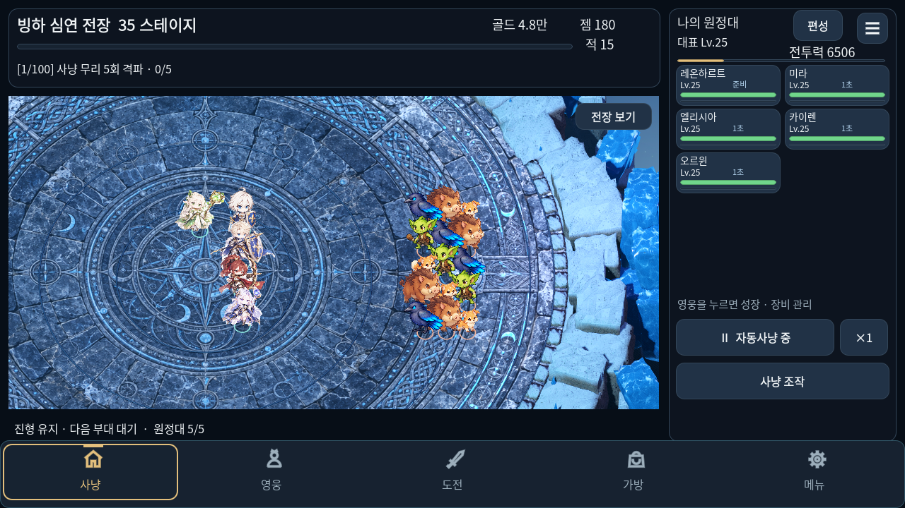
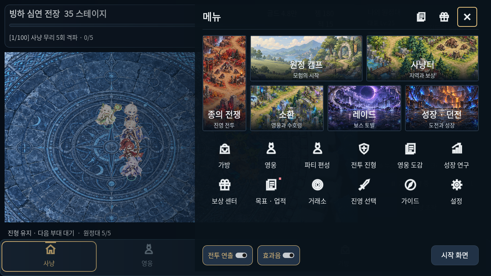
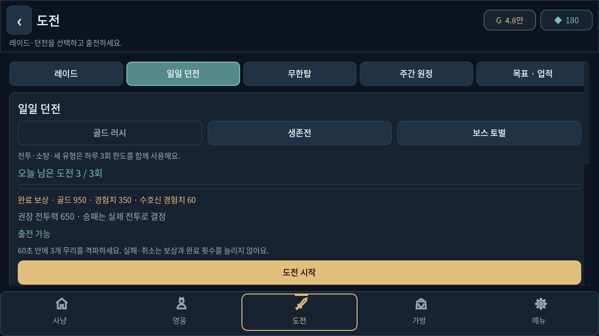
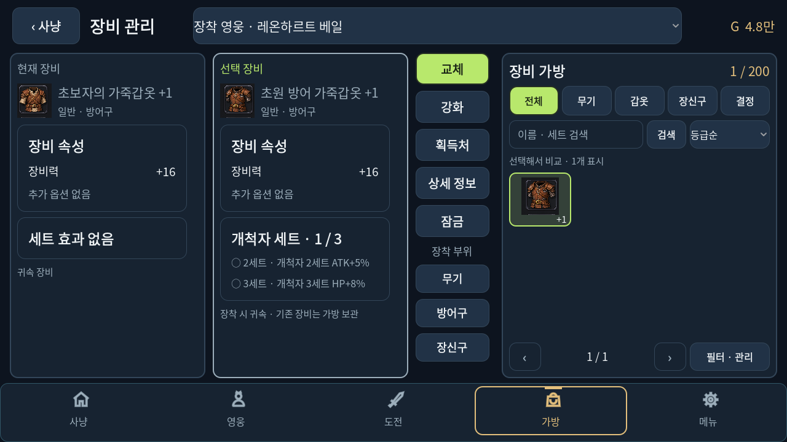

# 게임 조작 간소화

사용자 요청으로 전체 메뉴는 이전 그림 카드·아이콘 화면으로 복원했다. 하단 이동, 사냥 조작, 도전 요약, 가방 개선은 유지했다. 최신 메뉴 복원 검사는 `checks/menu-restore/validation.json`에 기록한다.

하단 이동을 **사냥 · 영웅 · 도전 · 가방 · 메뉴**로 정리했다. 사냥은 현재 사냥으로, 도전은 레이드 선택으로 이동한다. 메뉴를 닫거나 화면 크기가 바뀌어도 진행 중인 전투 상태를 유지한다.

## 바뀐 화면

- 사냥 화면: 일시정지/재개, 배속, 편성, 사냥 조작을 바로 사용할 수 있다. 스킬 자동 사용·궁극기 자동 사용·진형·사냥 통계·지도·설정은 사냥 조작 창에서 연다. 오프라인 보상은 받을 것이 있을 때 표시한다. 조작 창의 닫기는 스크롤해도 자리를 유지한다.
- 전체 메뉴: 이전 그림 카드·아이콘·상단 빠른 이동·하단 소리/효과 설정 배치를 사용한다. 바깥 터치·닫기·뒤로 가기와 진행 중인 사냥 상태 유지 동작을 보존했다.
- 도전: 레이드·일일 던전·무한탑·주간 원정을 구분한다. 연습과 전투 프리셋은 접힌 선택 기능으로 두고, 던전 보상은 한 줄로 요약해 도전 버튼이 먼저 보이도록 했다. 메뉴의 던전 도전은 이전 목표 화면을 잘못 복원하지 않는다.
- 가방: 장착 대상 영웅을 명시하고, 효과가 없는 세트의 반복 설명을 줄인다. 가방의 뒤로 가기는 사냥으로 바로 돌아간다.
- 용어: 홈→사냥, 전투→도전, 원정 캠프→원정대 현황. 스킬·궁극기는 자동 사용 여부를 글자로 표시하고 골드·젬·전투력에 이름을 붙였다.






## 검증

아래 기록은 최초 간소화 작업 당시 결과다. 이후 사용자 요청으로 메뉴를 복원하고, 현재 메뉴에 맞춰 터치 검사와 캡처 도구를 갱신했다.

Godot 4.6.3에서 실제 ScreenTouch 입력으로 분류 전환, 사냥 조작, 영웅 편성, 도전, 가방, 설정 이동을 확인했다. 1280×720·1560×720·640×360·1920×1080 창에서 버튼 겹침과 메뉴 영역을 검사했다. 작은 창도 기존 가로 논리 화면을 사용한다. 영웅 성장·사냥 상태 유지·레이드 카탈로그·드래그 스크롤·저장 실패 보호·초반 안내 등의 현재 회귀 검사 13개가 통과했다. 결과와 파싱 기록은 `checks/simple-ux/`에 있다.

별도로 실행한 `V56DungeonRosterUiSmokeTest`는 이전 커밋과 수정 후 모두 같은 84개 오류를 보고했다. 과거 영웅/장비 화면의 컨트롤 이름과 세로 화면 경계를 사용하는 진단이 포함되어 있다. 익명 Label 번호만 정규화하여 오류가 동일함을 확인했고 두 로그와 비교를 `validation.json`에 보관했다. 이 검사를 통과한 것으로 집계하지 않는다.

화면 캡처는 데스크톱 OpenGL 호환 렌더러로 생성했다. 실제 휴대폰 APK 조작·성능 검증은 별도로 필요하다.

재현 시 사용자 저장과 분리된 `XDG_DATA_HOME`, `XDG_CONFIG_HOME`, `XDG_CACHE_HOME`을 사용한다.

```sh
godot --headless --path . --script scripts/SimpleUxSmokeTest.gd
# 디스플레이가 있는 환경에서 실제 화면을 저장한다.
godot --path . --rendering-method gl_compatibility --audio-driver Dummy --script tools/capture_simple_ux.gd
```
