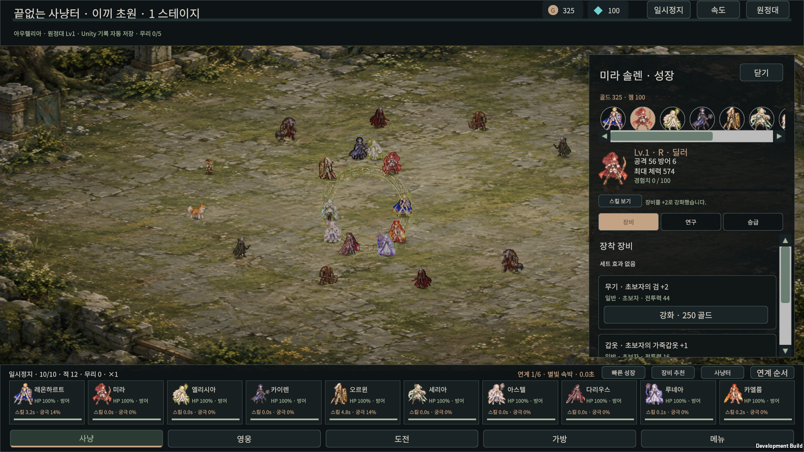
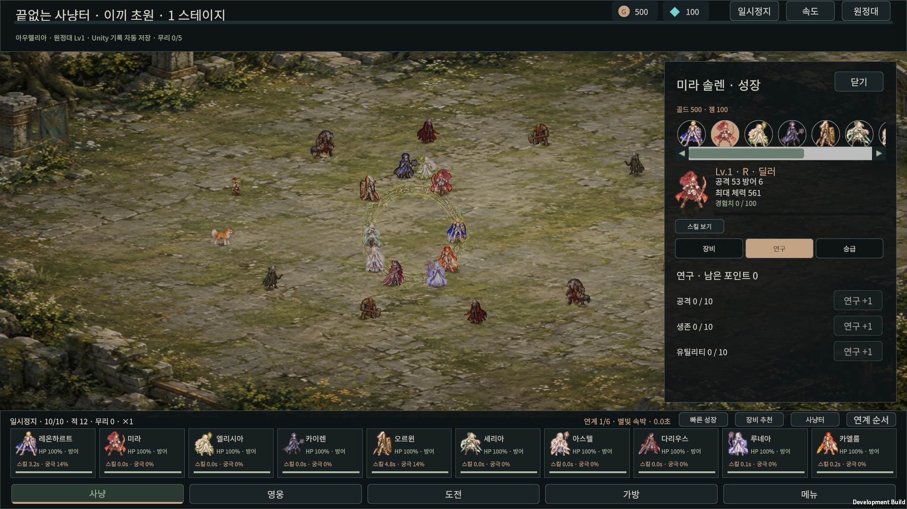
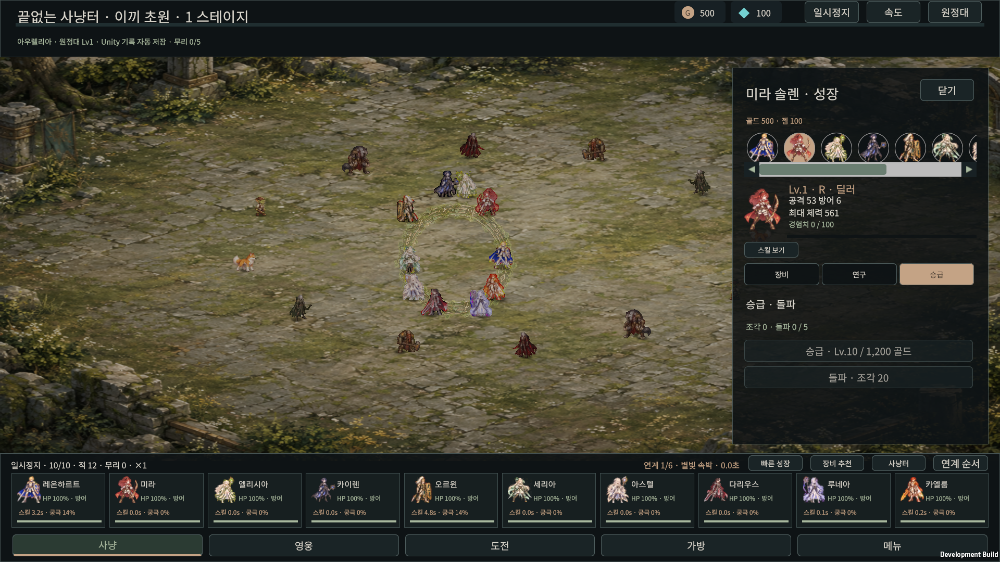
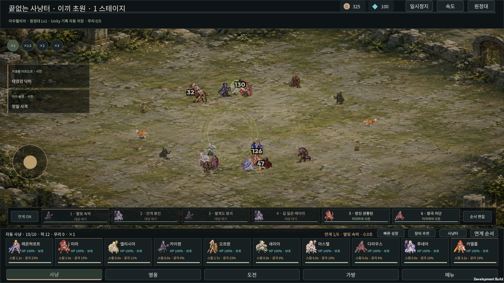
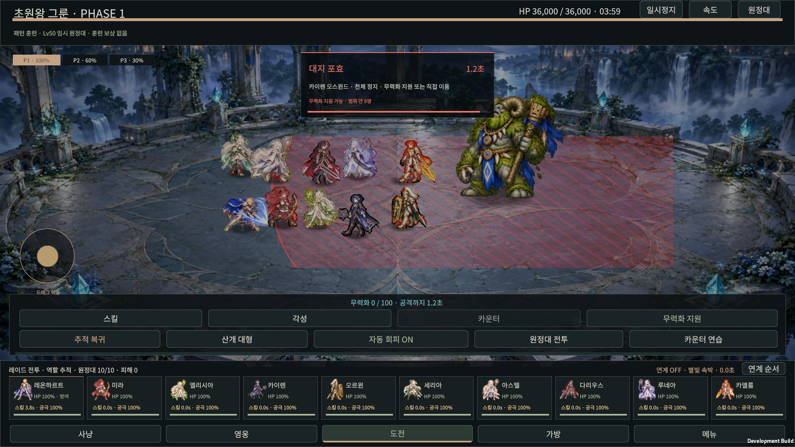
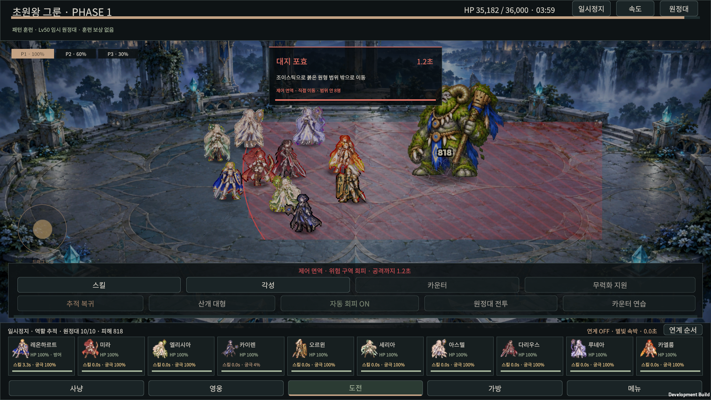
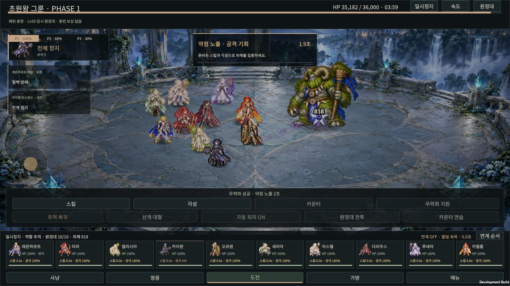
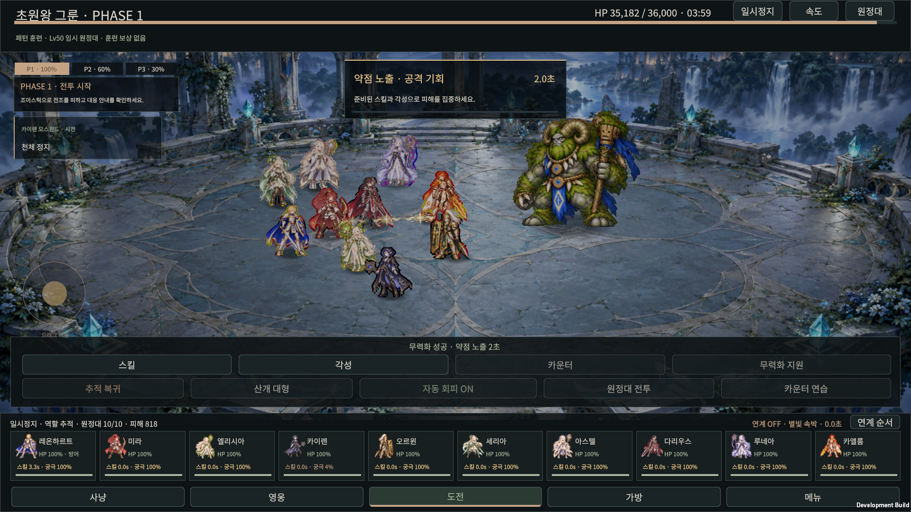
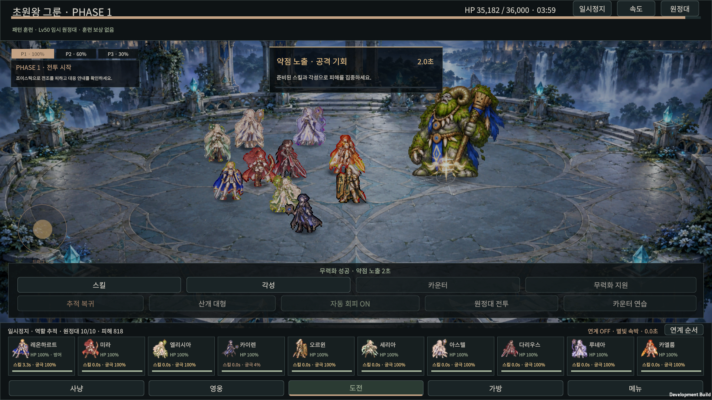

# 네 참고 방향 전투·성장 정리 · 17차

30명 영웅, 120개 원래 스킬 정의, 성장 기록, 10인 원정대와 세 지역 레이드를 유지합니다. [현재 참고 기준](REFERENCES.md)에 따라 16차의 공통 교전·스킬 강조·성장·무력화 지원을 보강합니다. 프레임 최적화는 마지막 순서입니다.

| 방향 | 적용 |
|---|---|
| 세븐나이츠 키우기 · 10인 사냥 | 공통 교전 방향을 기준으로 전열·측면·원거리·지원 접근 경로를 선호 |
| 픽셀법사 키우기 · 스킬 표현 | 투사체 발사 중 목표 폭발이 먼저 보이던 표현을 발사→명중→잔향 순서로 정리 |
| 소울스트라이크 · 성장 UX | 고정 영웅 요약과 장비·연구·승급 전용 탭, 선택 영웅/탭 유지 |
| 로스트아크 · 대응 안내 | 실제 준비 상태에 따른 무력화·카운터·직접 이동 안내와 위험 범위 안 영웅 수 |

## 동작과 범위

자동 사냥은 16차 공통 교전 후보의 위치에서 원정대의 접근 방향을 구합니다. 탱커·근접은 전열, 지원은 후열, 컨트롤러는 측면, 원거리는 뒤쪽 접근 목표를 선호합니다. 기존 18방향 후보·적 거리·아군 예약·몸통 충돌에 더하는 선호 점수입니다. 이미 공격 가능한 자리는 유지하며 공격 준비 중에는 새로 움직이지 않습니다. 진형을 강제로 배치하거나 영웅을 순간 이동시키지 않습니다. 조이스틱 직접 이동이 우선합니다. 원화의 망토·무기가 화면에서 전혀 겹치지 않는다는 보장은 아닙니다.

실제 시전 이벤트를 받은 원거리/궁극기의 짧은 시각적 비행이 끝난 뒤 목표의 원화 명중·강조 실루엣을 시작합니다. 이후 작은 잔향으로 마무리합니다. 근접 명중과 실제 수혜자의 회복·방패는 즉시 표시합니다. 중단된 충전은 폭발을 만들지 않습니다. **이 타이밍은 표현만 정리하며 원래 피해·제어·쿨다운·게임 시간을 늦추지 않습니다.** 8종 공유 원화 모양과 7종 공유 강조 실루엣을 사용하며, 120개 독립 이펙트 원화의 최종 완성을 의미하지 않습니다.

성장 화면의 재화·현재 영웅 능력치·경험치는 위쪽에 남고 선택한 탭의 내용만 표시합니다. 다른 영웅 선택과 강화 후에도 탭을 유지합니다. 비용과 저장은 기존 명령을 사용하며 탭 이동은 재화를 쓰지 않습니다. 승급·돌파의 레벨·골드·조각 제한은 그대로 적용합니다. UI 선택은 현재 실행의 탐색 상태이며 새 저장 필드를 만들지 않습니다.

레이드 안내는 더 빨리 닿는 전조를 우선합니다. 카운터 창에서는 실제 정면 영웅의 가능 여부를 확인하고, 그 밖의 전조에서는 준비된 기존 스턴 스킬을 이름과 함께 안내합니다. 제어 면역이나 스킬 미준비 상태에서는 조이스틱으로 해당 원형·고리·부채꼴·직선·표식 밖으로 이동하도록 안내합니다. “범위 안 N명”은 그 전조의 고정된 판정 도형 안에 있는 살아 있는 영웅 수입니다. 새로운 피해·무적·자동 순간 회피·추가 공격 대상을 만들지 않습니다.

## 검수

도메인·실제 입력·빌드 결과와 실제 캡처는 `checks/unity-migration-2026-10-08/`의 17차 파일에 기록합니다. 실제 사용자 저장은 열거나 덮어쓰지 않습니다. 훈련 전조·자원과 일시정지한 제어 면역 화면은 명시적인 보상 없는 검수 조건입니다. 스킬 비행/명중 캡처는 일시정지한 전투에서 읽기 전용 표현 이벤트를 넣은 샘플이며, 그 화면의 실제 게임 시전을 증명하지 않습니다.

- 접근 경로·공격 자리 유지·현재 대응/범위 집계 **24**, 원래 영웅 30명을 포함한 이동 **264,792**, 네 진형·확장 맵·보상 **297,396**, 대응/연계 **21**, 스킬 표현 **1,288** 비교를 통과했습니다.
- `combat-polish-cp17.json`, `hunt-world-cp17.json`과 현재 `movement-planner.json`, `native-skill-vfx.json`이 결과를 기록합니다. 모든 의상 실루엣의 완전 분리나 120개 개별 스킬의 사람 눈 검수를 뜻하지 않습니다.
- 최종 Windows 실제 입력 **26**, 기존 플레이 **34**, 프로세스 재실행 저장 복원 **7** 검사를 통과했습니다. `native-feature-focus-cp17.json`과 `native-game-*-cp17.json`에 기록합니다. 승급 제한, 탭 유지, 스크롤 없이 보이는 무기 강화, 실제 보상 정산과 원래 무력화 스킬 입력을 확인합니다.
- 최종 빌드 `build_d4dbfe58cc6e`는 오류 0개, 예상된 Player Pipeline 비활성 경고 1개로 성공했습니다. `windows-game-build-cp17.json`에 기록합니다. 작업용 batch Editor는 저장 후 정상 종료했습니다.

## 실제 화면

| 연구 | 승급 |
|---|---|
|  |  |

| 준비된 원래 무력화 스킬 | 제어 면역의 직접 이동 안내 | 무력화 후 공격 기회 |
|---|---|---|
|  |  |  |

| 미라 표현 샘플 · 비행 | 미라 표현 샘플 · 명중 |
|---|---|
|  |  |

기능·화면 흐름의 구현 단계입니다. 영웅별 독립 최종 연출, 전체 그래픽 마감, 모바일 터치와 최종 성능은 남습니다. 이번 묶음에서 FPS·메모리 벤치마크, GUI Editor 초기화 복구나 이전 DOF/Panini 셰이더 누락 해결을 주장하지 않습니다.
