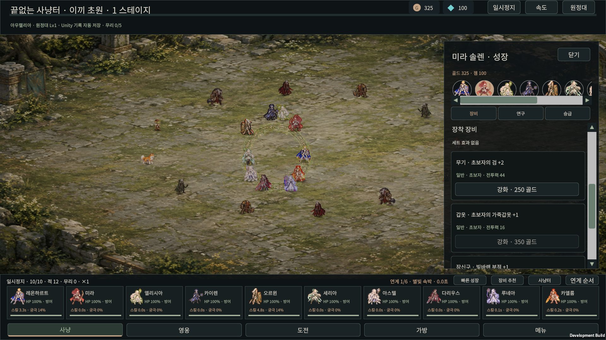
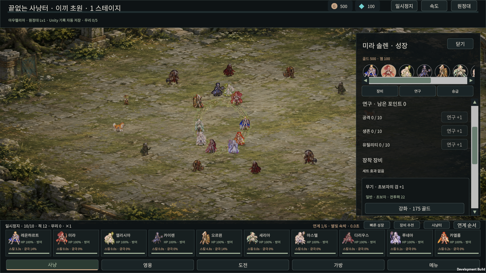
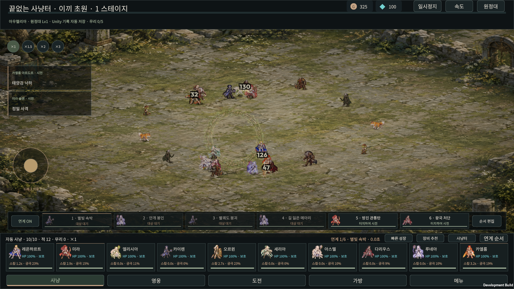
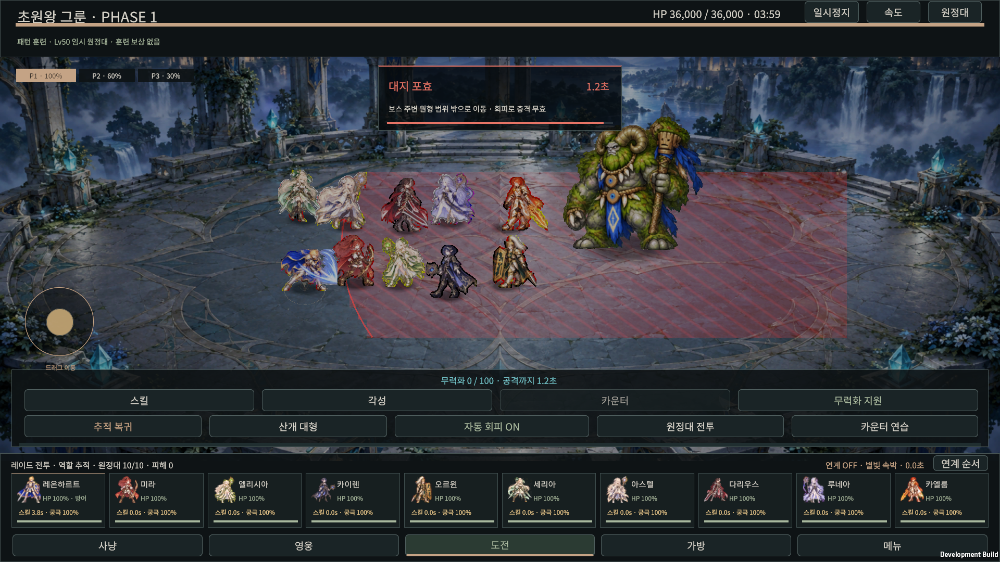
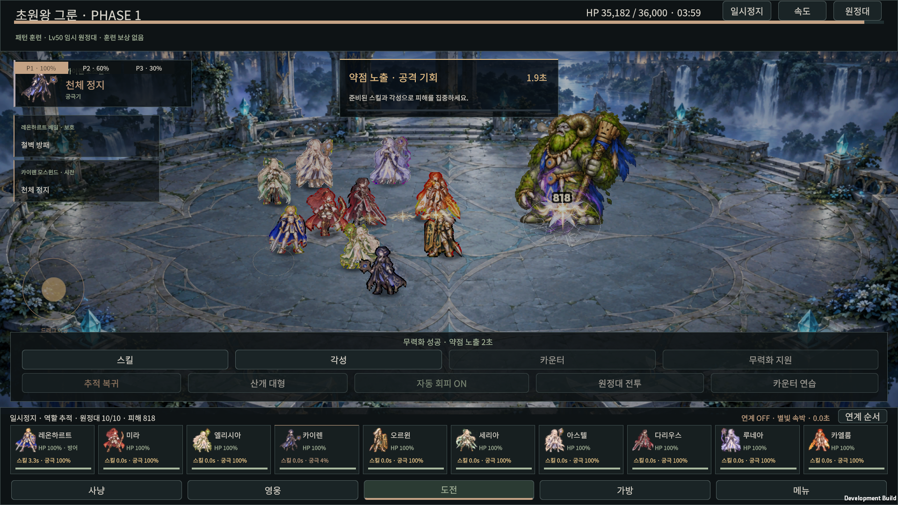
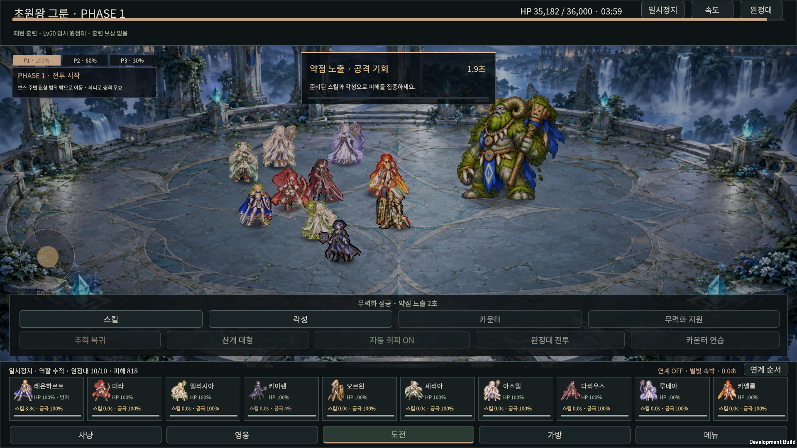
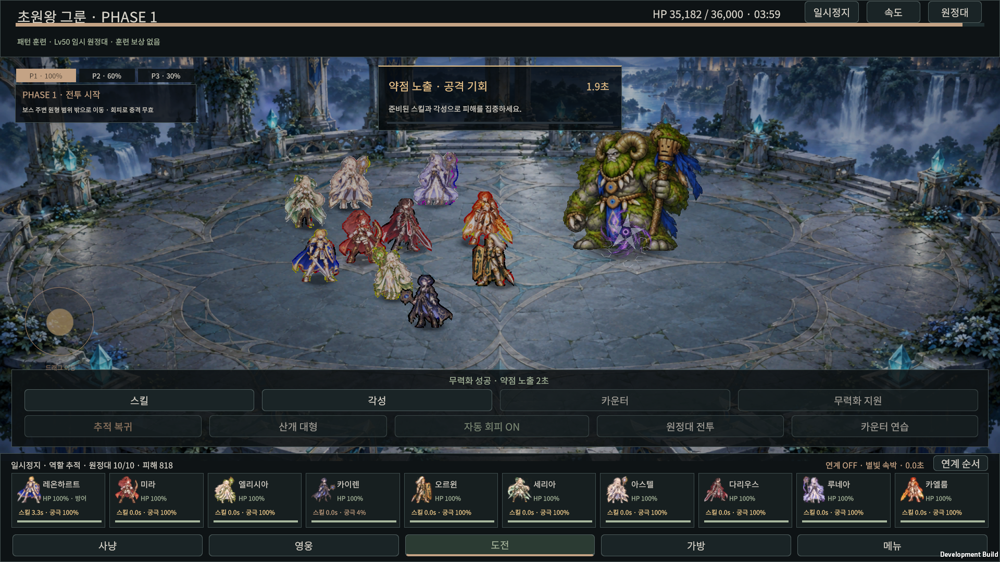

# 네 참고 방향 집중 개발 · 16차

30명 영웅·120개 스킬·성장 기록·10인 원정대·세 지역 레이드와 원화 기반 2.5D 방향을 유지합니다. 네 참고 게임의 역할은 [현재 참고 기준](REFERENCES.md)에 고정했습니다. 이번 묶음은 게임 전체 완성이나 참고 게임과 같은 최종 퀄리티를 의미하지 않습니다.

| 참고 방향 | 이번 적용 |
|---|---|
| 세븐나이츠 키우기 · 10인 사냥 | 원정대 중심에서 가까운 적을 공통 교전 대상으로 고르고, 먼 곳으로 따로 쫓아가는 이동 목표를 제한 |
| 픽셀법사 키우기 · 스킬 선명도 | 기존 원화 이펙트 위에 칼날·얼음 가시·방패 문장·잎·화살·보석·별 모양의 선명한 실루엣 추가 |
| 소울스트라이크 · 그래픽/UI/UX | 성장 화면에 현재 원정대의 원형 영웅 선택, 고정 재화 표시, 경험치 바, 장비 카드와 장비·연구·승급 바로가기 |
| 로스트아크 · 기믹 대응 | 전조 중 준비된 기존 스턴 스킬로 실제 무력화를 지원하는 버튼과 시전 영웅·스킬 안내 |

## 실제 동작

자동 사냥은 원정대의 살아 있는 영웅 중심에서 가까운 적을 최대 6명까지 공통 후보로 선택합니다. 가장 가까운 적보다 4 월드 단위 이상 먼 적은 이 후보에서 제외합니다. 이미 공격 가능한 가까운 적은 그대로 마무리할 수 있습니다. 기존 역할별 목표 점수·공격 거리·공격 준비·몸통 충돌을 유지하며, 공격하러 이동할 때 목표가 원정대 중심에서 지나치게 멀어지지 않게 제한합니다. 현재 위치를 강제로 옮기는 규칙이 아닙니다. 적이 없는 동안은 현재 원정대 중심을 기준으로 원래 진형으로 재집결합니다. 보너스 능력치·재화·드롭 확률은 바꾸지 않습니다.

직접 조이스틱 이동은 자동 교전 선호보다 우선합니다. 손을 떼면 정지하며, 자동 추적으로 돌아갈 때 공통 교전 목표를 사용합니다. 카메라를 드래그하지 않고 ×1/×1.5/×2/×3 확대 중심을 유지합니다.

스킬의 선명한 모양은 기존 영웅별 색·문양·스킬 분류에 맞춰 실제 시전과 수혜 이벤트에 붙습니다. 칼날은 공격 방향을 따르고, 회복·방패는 실제 수혜자를 기준으로 그립니다. 강조 모양은 0.36초 안에 사라지고 기존 충전·발사·명중·여운 타임라인을 유지합니다. 레이드 전조 중에는 강조도 어둡게 합니다. **일곱 공유 기하 모양과 기존 원화 아틀라스의 조합**이며, 새로 제작한 120개 독립 원화 이펙트나 GPU 파티클을 의미하지 않습니다. 피해·쿨다운·게임 시계를 바꾸지 않습니다.

성장 화면의 원형 초상으로 현재 원정대 영웅을 바꿉니다. 초상 선택과 섹션 바로가기는 재화를 쓰지 않습니다. 바로가기는 섹션을 화면 위에 맞추며, 강화 후에도 선택한 섹션을 유지합니다. 강화·연구·승급은 기존 개별 버튼으로 실행하고, 저장·비용·실제 전투 능력치 갱신도 기존 명령을 사용합니다. 보호 장비를 자동 분해하거나 일괄 재화를 소비하지 않습니다.

**무력화 지원**은 전조 중, 제어 면역이 없고, 행동 가능한 영웅에게 준비된 기존 `stun` 스킬이 있을 때만 활성화됩니다. 재사용 대기·궁극기 자원·거리·원래 스킬 정산을 그대로 거쳐 시전합니다. 스킬이 실제 무력화 게이지를 올리고 기준에 도달하면 보스 공격을 중단합니다. 새로운 무적이나 긴급 회피를 만들지 않습니다. 제어 면역·일시정지·전조 없음·사용 가능한 스킬 없음에서는 사용할 수 없습니다. 별도 카운터 연습 모드 중에도 이 버튼은 비활성화합니다.

## 확인 범위

- 통합 교전/기믹 도메인 **170,074** 비교: 몸통 간격·이동량 제한·세 지역 20초씩 진행·기존 스킬의 무력화 정산과 제한 조건.
- 이펙트 **1,220** 비교: 120개 프로필·30개 문양·일곱 강조 모양·실제 지원 수혜자·전조 우선·유한한 타임라인. 모든 120개를 사람 눈으로 각각 최종 검수한 뜻은 아닙니다.
- 기존 레이드 **33,593**, 공통 조이스틱 **72,210** 비교도 통과했습니다.
- Windows 실제 입력 **17**, 일반 플레이 **34**, 프로세스 재실행 저장 복원 **7** 검사를 통과했습니다. 기록은 `native-feature-focus-cp16.json`과 `native-game-*-cp16.json`입니다. 임시 프로필을 사용하며 실제 사용자 저장을 읽거나 덮어쓰지 않습니다.
- 최종 빌드 `build_73ca9448e323`은 오류 0개, 예상된 Player Pipeline 비활성 경고 1개로 성공했습니다. `windows-game-build-cp16.json`에 기록합니다. C# 컴파일 실패가 없으며 작업용 batch Editor는 저장 후 정상 종료했습니다.

사냥 보상 검사는 실제로 무리를 격파해서 수행합니다. 레이드 무력화 화면은 보상 없는 Lv50 훈련에서 전조·자원을 명시적으로 맞춘 검수 조건입니다. 이펙트 샘플은 일시정지한 전투에 읽기 전용 표현 이벤트를 넣어 렌더링한 것으로, 해당 순간에 게임 스킬을 실제 시전한 증거가 아닙니다. 원래 스킬 실행·피해·자원 정산은 별도 도메인과 무력화 입력 검사로 확인합니다.

## 실제 실행 화면

아래 이미지는 최종 Windows 개발 빌드의 실제 캡처입니다. 장비 이미지는 실제 미라 선택·강화 후 화면이고, 스킬 샘플은 위에 명시한 읽기 전용 렌더링 조건입니다.

| 미라 공격 표현 | 오르윈 지원 표현 | 카이렌 공격 표현 |
|---|---|---|
|  |  |  |

이번 묶음은 프레임·메모리 벤치마크를 하지 않습니다. 휴대폰 터치·모바일 최종 성능, 전체 콘텐츠, 모든 스킬의 개별 최종 연출과 최종 원화 품질은 남습니다. GUI Editor UPM 초기화 문제와 이전 DOF/Panini 셰이더 누락도 이번 기능 개발에서 해결했다고 주장하지 않습니다. 필요한 작업용 batch Editor만 사용하고 저장 후 닫습니다.
